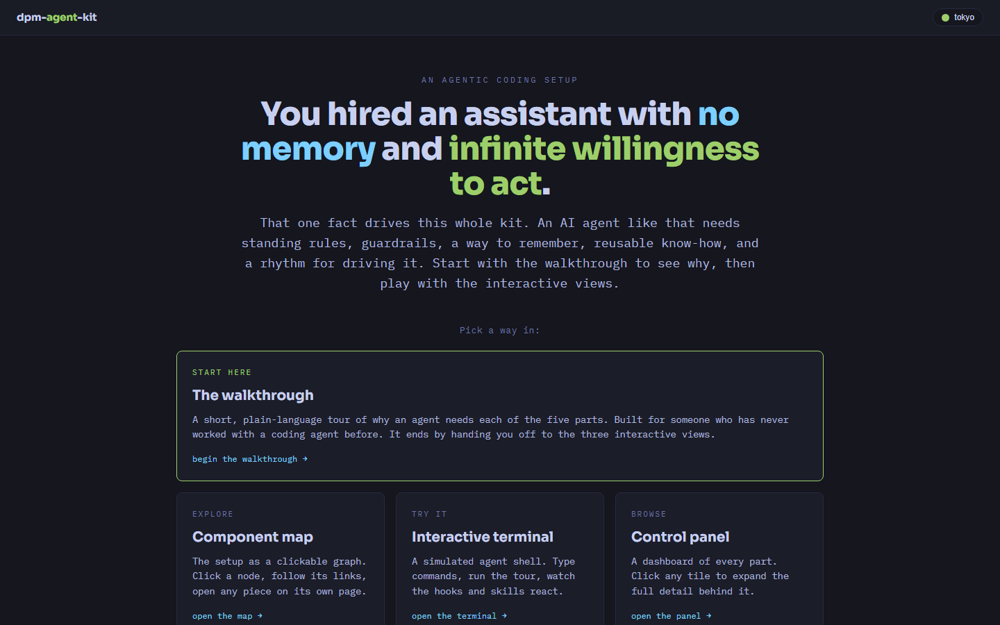

# dpm-agent-kit

[](https://dpm-agent-kit.vercel.app)
[](LICENSE)



A drop-in kit that captures a complete, opinionated **agentic coding setup** for Claude Code —
skills, security hooks, the memory system, the `CLAUDE.md` behavioral contract, and the daily
workflow — so you (or anyone) can stand the whole thing up in one move.

Point an agent at this folder and say *"read INSTALL.md and set this up"* and it will wire in the
hooks, drop the templates, and walk you through the rest. Or run the script. Everything here is
**public and scrubbed** — no secrets, no private paths. A walkthrough explains exactly where *you*
add your own sensitive bits back.

---

## What's in the box

| Path | What it is |
|---|---|
| `INSTALL.md` | Agent-driven install guide — the "drop an agent in here" entry point. |
| `install.ps1` / `install.sh` | Runnable installers (Windows PowerShell / macOS-Linux bash). |
| `templates/hooks/` | 18 dependency-free Node hooks: secret-exposure guards, exfil/dangerous-command blocks, secret-output scanners, plus workflow hooks (session primer, task-state reminder, audit log). |
| `templates/settings/` | `settings.json` template wiring every hook to its lifecycle event. |
| `templates/claude-md/` | A lean, reusable `CLAUDE.md` + `CLAUDE-delegation.md`, and the modular pattern behind them. |
| `templates/memory/` | The append-only auto-memory system (index + four memory types + how-to). |
| `templates/skills/` | Vendored custom skills (scrubbed) + docs/install-prompts for web-installed skills (superpowers, grill-me). |
| `templates/repo-map.md` | A starter "which local path → which GitHub repo" map, so the agent never commits/pushes to the wrong remote. |
| `docs/DETAILED-GUIDE.md` | How the whole thing works, end to end — the deep read. |
| `docs/HANDLING-SECRETS.md` | Where and how to add your real paths/keys/policy back, safely. |
| `docs/SETUP-PREFLIGHT.md` | Pre-install checklist: Node, Claude Code, gh, git identity, Vercel CLI. |
| `explorable/` | Interactive HTML explorables (intro hub, walkthrough, node-map, terminal, control panel) + a searchable **library** of every part + an aesthetic-options gallery. Open any in a browser or visit the [live site](https://dpm-agent-kit.vercel.app). |
| `explorable/skills-library.html` | A searchable, filterable index of the whole kit — skills, hooks, memory notes, AI-coding tricks, loop types, and config maps — with a ⌘K global palette. |
| `docs/HARNESS-AND-LOOPS.md` | The engineering layer above the five pillars: harness design, the loop-type catalog, the file/output model, and custom lints. |
| `obsidian/` | A Superpowers skills guide formatted for an Obsidian vault. |

---

## The five pillars

1. **Skills** — composable `/slash-command` workflows. The [superpowers](https://github.com/obra/superpowers) framework (brainstorm → plan → execute → verify) plus your own custom skills.
2. **Hooks** — Node scripts Claude Code runs at lifecycle events to enforce security (no secret leakage, no exfiltration, no accidental destruction) and workflow (resume state, audit, format).
3. **Memory** — a file-based system that persists who you are, how you work, and project context across conversations, with a thin always-loaded index.
4. **CLAUDE.md** — the always-on behavioral contract: voice, anti-fabrication, file-safety, autonomy, careful-actions.
5. **Workflow** — how you actually run sessions: long threads ridden through compaction, `CURRENT-TASK.md` handoffs, the `/rollover` ritual, delegation via the two-question test, and parallel sub-agents.

## Plugged-in tools (documented here, installed separately)

- **Obsidian** — the notes vault the agent reads/writes (with a delete-guard hook).
- **Wispr Flow** — voice dictation for speaking long prompts to the agent (~150 wpm vs ~60 typing).
- **wmux** — a Windows-native, multi-agent terminal multiplexer: run several agents side by side in panes, with agent-to-agent messaging and browser automation over a shared repo.
- **claude-global-config** — the `~/.claude/` directory as a portable git repo (the "source of truth" for how the agent behaves across machines).
- **dpm-sites hub** — a personal landing/index page + a profile knowledge base agents read for outreach/portfolio copy.

See `docs/DETAILED-GUIDE.md` for how each fits.

---

## Quick start

**Agent-driven (recommended):** open this folder in Claude Code and say
> *Read `INSTALL.md` and set up this kit for me. Ask me before touching my existing `settings.json`.*

**Script:**
```bash
# macOS / Linux
bash install.sh
```
```powershell
# Windows
pwsh -File install.ps1
```

Then read `docs/HANDLING-SECRETS.md` to add your own paths and policy. Nothing here will leak a
secret — the hooks make sure of that, and they're the first thing the installer turns on.

> Requires Node.js (for the hooks) and a recent Claude Code build (for `/plugin install`).
